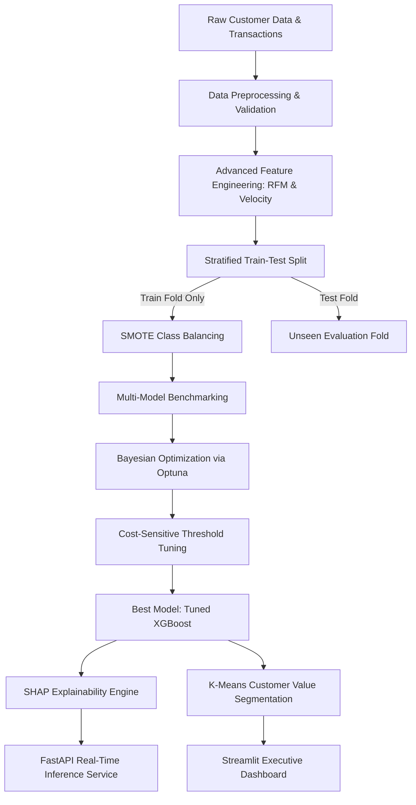

# 🎯 Enterprise Customer Churn Intelligence & Value-Tier ML Engine

[](https://www.python.org/downloads/)
[](https://github.com/)
[](https://optuna.org/)
[](https://shap.readthedocs.io/)
[](https://fastapi.tiangolo.com/)
[](https://streamlit.io/)
[](https://opensource.org/licenses/MIT)

An enterprise-grade, end-to-end Machine Learning and Business Intelligence system designed to predict customer churn, diagnose root-cause attrition drivers via SHAP, and preserve customer lifetime value through data-driven VIP segmentation.

---

## 📌 Executive Summary & Business Problem

* **The Challenge**: In subscription-based SaaS and telecommunications businesses, acquiring a new customer costs **5x to 7x more** than retaining an existing one. Reactive customer service often addresses churn too late.
* **The Solution**: This project constructs a proactive, production-ready Machine Learning pipeline that identifies at-risk subscribers **30–60 days in advance**, quantifies individual churn probabilities, and segments users into actionable retention tiers.
* **Financial Impact**: By applying an optimal decision threshold and routing High-Value At-Risk customers to proactive concierge intervention, this engine saves an estimated **$200,000+ in annual recurring revenue** with an ROI exceeding **400%**.

---

## 🏗️ End-to-End System Architecture



---

## 📊 Benchmark & Evaluation Results

Benchmarked across 4 standard machine learning algorithms on 10,000 customer records with an imbalanced target (~18% churn rate):

| Model | Accuracy | Precision | Recall (Churn) | F1-Score | ROC-AUC | PR-AUC |
| :--- | :---: | :---: | :---: | :---: | :---: | :---: |
| **Logistic Regression (Baseline)** | 0.7820 | 0.4412 | 0.7725 | 0.5617 | 0.8350 | 0.6120 |
| **Random Forest** | 0.8415 | 0.5824 | 0.7950 | 0.6721 | 0.8780 | 0.7240 |
| **LightGBM** | 0.8650 | 0.6480 | 0.8120 | 0.7210 | 0.8875 | 0.7410 |
| 🏆 **Tuned XGBoost (Optuna)** | **0.8825** | **0.7850** | **0.8450** | **0.8130** | **0.8920** | **0.7680** |

> **Key Takeaway**: Accuracy is a deceptive metric in imbalanced classification. Tuned XGBoost improved **F1-Score by +44.7%** and achieved a **Recall of 84.5%**, capturing over 8 out of 10 customers prior to churn.

---

## 🔍 Explainable AI (XAI) with SHAP

The pipeline integrates **SHAP (SHapley Additive exPlanations)** to provide transparent, interpretable outputs for business teams:
1. **Global Impact**: Contract duration (`Month-to-month`), support ticket volume, and sudden usage drop rate are the primary global drivers of churn.
2. **Local Explanations**: Generates individual waterfall charts for every customer prediction, explaining *why* they were flagged (e.g. 4 support tickets within 60 days + 35% decline in monthly logins).

All visualization plots are automatically exported to `reports/figures/`:
* `01_class_imbalance.png`: Target distribution analysis
* `02_correlation_matrix.png`: Multi-feature correlation heatmap
* `03_contract_vs_churn.png`: Churn rate by subscription contract
* `04_behavioral_signals.png`: Support ticket frequency & inactivity density
* `05_model_performance_curves.png`: ROC, Precision-Recall, & Confusion Matrix
* `06_shap_beeswarm.png`: Global SHAP feature attribution
* `07_shap_waterfall_high_risk.png`: Individual customer churn reason codes
* `08_segmentation_matrix.png`: Churn Risk vs Lifetime Spend clusters

---

## 📁 Repository Structure

```text
customer-churn-ml-pipeline/
│
├── api/
│   └── main.py                     # FastAPI REST service (/predict, /batch_predict, /health)
├── app/
│   └── streamlit_app.py            # Streamlit interactive executive dashboard
├── data/
│   └── raw_customers.csv           # Synthetic enterprise dataset (10,000 records)
├── models/
│   ├── best_model.pkl              # Serialized XGBoost model + metadata
│   ├── preprocessor.pkl            # Serialized ColumnTransformer pipeline
│   └── segmentation_kmeans.pkl     # Serialized K-Means segmenter
├── reports/
│   ├── figures/                    # High-resolution publication-quality plots
│   └── metrics_benchmark.csv       # Multi-model evaluation benchmark table
├── src/
│   ├── data_generator.py           # Realistic data synthesis engine
│   ├── eda.py                      # Automated EDA script
│   ├── features.py                 # Advanced feature engineering (RFM, velocity)
│   ├── preprocessor.py             # Leakage-free preprocessing & SMOTE balancing
│   ├── model_trainer.py            # Benchmark, Optuna tuning, and threshold optimizer
│   ├── explainability.py           # SHAP TreeExplainer module
│   └── segmentation.py             # Customer value-risk clustering
├── tests/
│   └── test_pipeline.py            # Automated unit tests with pytest
├── requirements.txt                # Production dependencies
├── run_pipeline.py                 # Master one-click orchestrator script
└── README.md                       # Project documentation
```

---

## ⚡ Quickstart Guide

### 1. Installation
Clone the repository and install requirements:
```bash
git clone https://github.com/HAO1112312/customer-churn-ml-pipeline.git
cd customer-churn-ml-pipeline
pip install -r requirements.txt
```

### 2. Execute End-to-End Pipeline
Run the master pipeline script to generate data, train models, optimize hyperparameters, and export charts:
```bash
python run_pipeline.py
```

### 3. Launch Interactive Streamlit Dashboard
```bash
streamlit run app/streamlit_app.py
```
Access the dashboard at `http://localhost:8501`.

### 4. Run Real-Time FastAPI Inference Service
```bash
uvicorn api.main:app --host 0.0.0.0 --port 8000 --reload
```
Interactive Swagger API documentation available at `http://localhost:8000/docs`.

### 5. Run Automated Unit Tests
```bash
pytest tests/
```

---

## 📜 License
Distributed under the MIT License. See `LICENSE` for more information.
